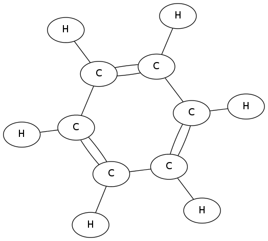

This is a sample stub playground sandbox for tonight's exercise.  Feel free to clone it if you plan
on bringing (and using) a laptop, but no worries if you don't.

The code is only ~100 lines of substance and ~50 of packing material, broken up in AOP style into five parts:

* The basic data structures
* Example calculation on the data (mass & emperical formula)
* A little DSL for creating interesting molecules, letting us write things like:

        water = O[H,H]
        ethanol = C[C,O[H]].hydrated

* Pretty printing support, which lets us produce graphviz drawings such as:

(In this case by running the ruby and then chaining graphviz & ImageMagick like so:

        neato benzene.dot -T png | convert - -scale 50% benzene.png

to make a png for github.  On many systems you can just display the xxxx.dot files)
* Some test cases

Since we're going to be working on a totally new aspect (IUPAC naming) you only really need to
understand the first section (~40 lines)--the rest are just there for fun, and to provide a little context.
